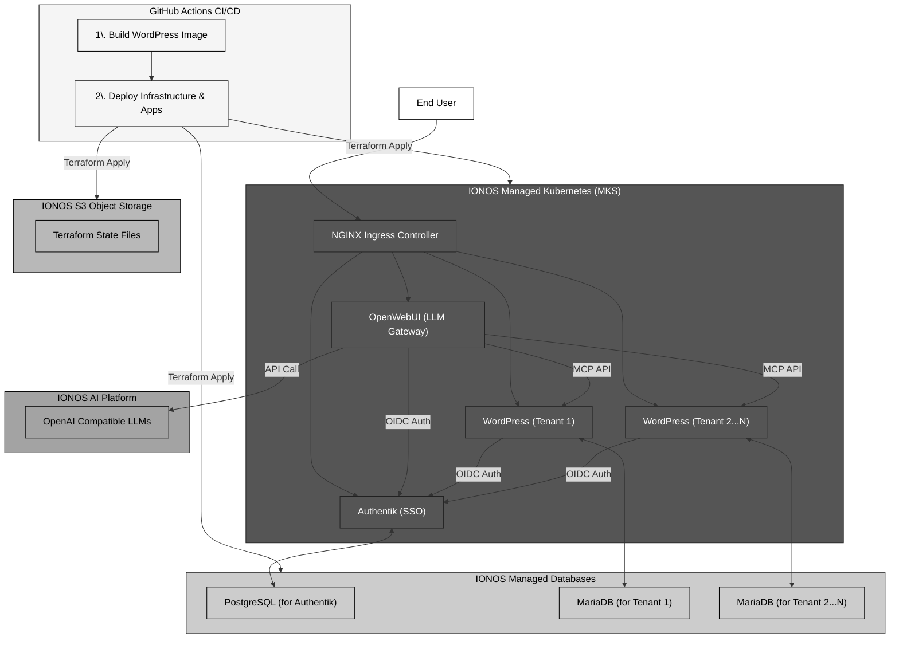

# WP-OpenWebUI Technical Overview

## 1. Project Vision & Goals

This document provides a comprehensive technical overview of the **WP-OpenWebUI Proof of Concept (PoC)**. The project's primary objective is to demonstrate a sophisticated, multi-tenant Software-as-a-Service (SaaS) platform built entirely on **IONOS Cloud**.

The core of the PoC is to deliver a seamless integration between four key applications:

- **WordPress:** A multi-tenant Content Management System (CMS), where each tenant operates in a fully isolated environment.
- **OpenWebUI:** A centralized, powerful web interface for interacting with Large Language Models (LLMs).
- **Authentik:** A robust, centralized identity and access management solution providing Single Sign-On (SSO) for all platform components.
- **IONOS AI Platform:** An OpenAI-compatible platform providing access to a variety of LLMs.

This platform is designed to be provisioned, configured, and deployed in a fully automated fashion, showcasing a modern, cloud-native approach to software engineering. The architecture emphasizes scalability, security, and operational efficiency, leveraging Infrastructure as Code (IaC) and GitOps principles.

## 2. System Architecture

The system is designed with a clear separation of concerns, using a multi-layered architecture that isolates platform services from tenant applications. All workloads are deployed on **IONOS Managed Kubernetes (MKS)**, ensuring high availability and scalability.

### Key Architectural Pillars:

- **Multi-Tenancy:**
  - **Application Layer:** A single, shared instance of OpenWebUI and Authentik serves all tenants, reducing operational overhead.
  - **Tenant Layer:** Each WordPress instance is deployed into its own dedicated Kubernetes namespace (`tenant-<name>`) and connected to its own private **IONOS Managed MariaDB** database. This provides strong data isolation and security between tenants.
- **Centralized Authentication:** Authentik acts as the single source of truth for user identity, providing OIDC-based SSO for both OpenWebUI and all WordPress tenants. This simplifies user management and enhances security.
- **Service Integration:**
  - OpenWebUI is configured to communicate with the **IONOS AI Platform**, an OpenAI-compatible LLM endpoint, for content generation.
  - A key innovation is the use of the **Model-Context-Protocol (MCP)**, enabling OpenWebUI to directly push generated content as draft posts to any authorized WordPress tenant.

## 3. Infrastructure as Code (IaC) with Terraform

The entire cloud infrastructure is defined and managed using Terraform, ensuring reproducibility, version control, and automated provisioning. The Terraform configuration is logically structured into three distinct layers, promoting a clean separation of concerns and enabling independent management of different infrastructure components.

### 3.1. Terraform Layers:

1.  **`infrastructure` Layer:**

    - **Purpose:** Provisions the foundational cloud resources.
    - **Key Resources:**
      - `ionoscloud_datacenter`: The virtual data center.
      - `ionoscloud_k8s_cluster`: The Managed Kubernetes (MKS) cluster.
      - `ionoscloud_k8s_node_pool`: The compute resources for the cluster.
      - `ionoscloud_lan`: A private network for secure communication between the MKS cluster and managed databases.
    - **State Management:** Terraform state is securely stored in an **IONOS S3 Object Storage** bucket.

2.  **`platform` Layer:**

    - **Purpose:** Deploys the shared, platform-level services that all tenants will use.
    - **Key Resources:**
      - `ionoscloud_pg_cluster`: A managed PostgreSQL instance for Authentik.
      - `helm_release`: Deploys the Authentik and OpenWebUI Helm charts into the `admin-apps` namespace.
      - `helm_release`: Deploys the NGINX Ingress Controller to manage external traffic.
      - `kubernetes_secret`: Manages secrets for OpenWebUI (e.g., the IONOS AI Platform API key) and Authentik.

3.  **`tenant` Layer:**
    - **Purpose:** Provisions and configures resources for each individual WordPress tenant. This layer is designed to be highly scalable.
    - **Key Resources:**
      - `ionoscloud_mariadb_cluster`: A dedicated, managed MariaDB instance for each tenant.
      - `kubernetes_namespace`: Creates an isolated namespace for each tenant.
      - `helm_release`: Deploys the tenant's WordPress instance using a custom Helm chart.
      - `random_password`: **Automated & Secure Password Generation.** For each tenant, a unique, strong password for the MariaDB database is generated at runtime. This password is used to provision the database and is immediately injected into a Kubernetes secret in the tenant's namespace. This avoids hardcoding credentials and ensures strict credential isolation per tenant.

This layered approach allows for granular control. For example, updates to the shared platform can be applied without affecting tenant configurations, and new tenants can be onboarded simply by adding an entry to a Terraform variable map, triggering the creation of all necessary resources for that tenant.

## 4. Kubernetes and Application Deployment

Applications are packaged and deployed onto the MKS cluster using **Helm**, the standard for Kubernetes package management. This approach ensures that deployments are consistent, configurable, and easily managed.

### 4.1. Custom Helm Charts:

The project utilizes custom Helm charts located in the `charts/` directory for each core application (WordPress, OpenWebUI, Authentik).

- **`charts/wordpress`:** This chart is highly configurable and designed for multi-tenancy. It manages:
  - A `Deployment` for the custom WordPress image.
  - A `Service` to expose WordPress within the cluster.
  - A `PersistentVolumeClaim` (PVC) to ensure that WordPress data (uploads, themes, etc.) is stateful.
  - An `Ingress` resource to expose the WordPress site externally.
  - A `Secret` template that is populated with the dynamically generated database credentials from the `tenant` Terraform layer.

### 4.2. Custom WordPress Docker Image:

A custom WordPress Docker image is built to include all necessary dependencies, ensuring a consistent runtime environment. The `docker/wordpress/Dockerfile` defines an image that bundles:

- The base WordPress installation.
- The **`wordpress-mcp`** plugin to enable communication with OpenWebUI.
- An **OIDC client plugin** to handle SSO integration with Authentik.

## 5. CI/CD and Automation with GitHub Actions

The project is underpinned by a robust CI/CD pipeline defined in GitHub Actions, which automates the entire build and deployment lifecycle. This GitOps-centric workflow ensures that the deployed infrastructure is always in sync with the code in the main branch.

### 5.1. Workflows:

1.  **`build-and-push-wordpress.yml`:**

    - **Trigger:** On changes to the WordPress Dockerfile (`docker/wordpress/**`).
    - **Action:** Automatically builds the custom WordPress Docker image, tags it with the Git SHA, and pushes it to the project's private **IONOS Container Registry**. This ensures that every change to the WordPress environment is versioned and ready for deployment.

2.  **`deploy.yml`:**
    - **Trigger:** On changes to the Terraform (`terraform/**`) or Helm (`charts/**`) configurations.
    - **Action:** Executes the multi-stage Terraform deployment in the correct order:
      1.  **Plan & Apply `infrastructure`:** Sets up the foundational K8s cluster.
      2.  **Plan & Apply `platform`:** Deploys the shared Authentik and OpenWebUI services.
      3.  **Plan & Apply `tenant`:** Deploys or updates all WordPress tenant instances. The image tag from the build workflow is passed here, ensuring the latest version is deployed.
    - **Secrets Management:** The workflow leverages **GitHub Actions Secrets** to securely store sensitive credentials like the `IONOS_TOKEN` and container registry passwords. These secrets are safely passed to Terraform at runtime, avoiding any exposure in the codebase.

## 6. Security Posture

Security is a foundational principle of this architecture, addressed at multiple levels.

- **Infrastructure Security:**

  - **Network Isolation:** A dedicated LAN is used to ensure that the Kubernetes cluster and the managed databases communicate over a private, secure network, not exposed to the public internet.
  - **Managed Services:** Leveraging IONOS Managed Kubernetes and Databases offloads the security patching and maintenance of the underlying infrastructure to IONOS.

- **Credential Management:**

  - **Dynamic Database Passwords:** As detailed in the Terraform section, each tenant's database password is programmatically generated and injected directly into a Kubernetes secret. This is a significant security enhancement over shared or manually managed passwords.
  - **GitHub Actions Secrets:** All high-privilege credentials required for the CI/CD pipeline are stored as encrypted secrets in GitHub.

- **Application Security:**
  - **Centralized SSO:** Authentik provides a single, secure point of entry for all applications, enabling consistent policy enforcement (e.g., multi-factor authentication) and simplifying user auditing.
  - **Tenant Isolation:** The use of separate Kubernetes namespaces and databases for each tenant prevents any cross-tenant data leakage at the application or infrastructure level.

## 7. Conclusion

The WP-OpenWebUI PoC successfully demonstrates the viability of building a complex, secure, and scalable multi-tenant SaaS platform on IONOS Cloud. By combining the power of **Terraform** for infrastructure automation, **Kubernetes** for container orchestration, **Helm** for application packaging, and **GitHub Actions** for CI/CD, the project establishes a modern, production-ready blueprint. The architecture's emphasis on security, particularly through automated and isolated credential management, showcases a deep understanding of cloud-native best practices.
