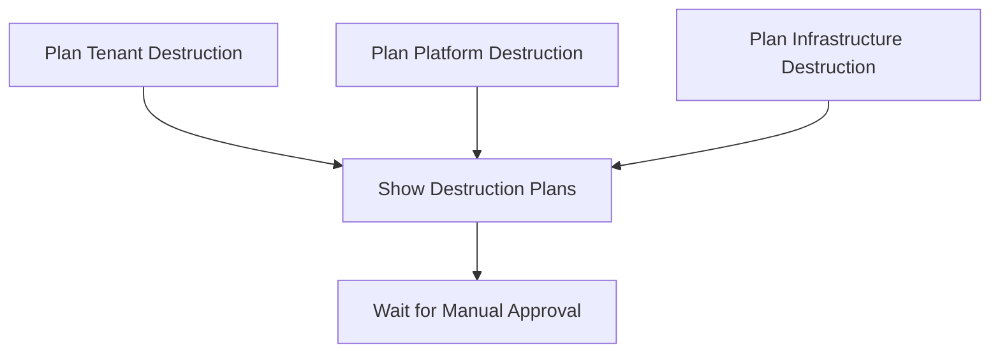
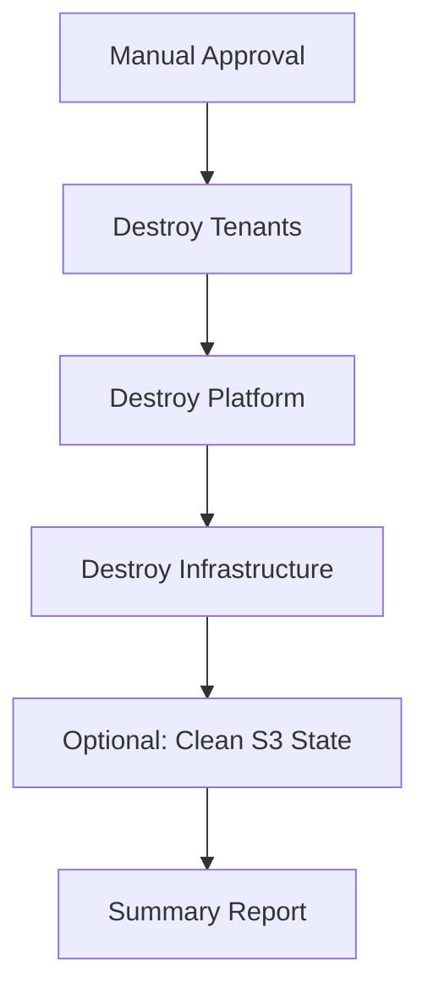

# Infrastructure Destruction Workflow

## Overview

The destruction workflow provides a safe, automated way to completely tear down the entire infrastructure. It uses GitHub Environments with manual approval to prevent accidental destruction.

## Setup Required

### 1. Create GitHub Environment

1. Go to your repository → Settings → Environments
2. Click "New environment"
3. Name: `destruction`
4. Add protection rules:
   - ✅ Required reviewers (add yourself/team members)
   - ✅ Prevent secrets from being accessed during deployment
   - Optional: Deployment branches (restrict to main/specific branches)

### 2. Environment Configuration

The `destruction` environment requires:
- **Required Reviewers**: At least one person must approve before destruction
- **Review Required**: Manual approval gate before any resources are destroyed

## Workflow Structure

### Phase 1: Planning (No Approval Required)


### Phase 2: Destruction (Requires Approval)


## Usage

### 1. Trigger Workflow
```bash
gh workflow run destroy.yml
```

Or via GitHub UI:
1. Go to Actions tab
2. Select "Infrastructure Destruction" workflow
3. Click "Run workflow"
4. **IMPORTANT**: Type `DESTROY` in the confirmation field
5. Click "Run workflow"

### 2. Review Destruction Plans
- Workflow will show what resources will be destroyed
- Review the plans in the workflow summary
- **No resources are destroyed yet**

### 3. Approve Destruction
- Go to the workflow run
- Click "Review deployments"
- Select `destruction` environment
- Click "Approve and deploy"

### 4. Monitor Progress
- Tenants destroyed first (WordPress, MariaDB)
- Platform destroyed second (Authentik, OpenWebUI, PostgreSQL)
- Infrastructure destroyed last (K8s cluster, datacenter)
- Optional: S3 state cleanup

## What Gets Destroyed

### Tenant Resources
- WordPress Helm releases
- MariaDB clusters
- Kubernetes namespaces and resources
- Container registry credentials

### Platform Resources
- Authentik SSO system and PostgreSQL database
- OpenWebUI application
- NGINX Ingress controller
- WordPress OAuth pipeline
- Kubernetes secrets and services

### Infrastructure Resources
- IONOS Kubernetes cluster
- Node pools
- Datacenter and networking (LAN)
- All associated IONOS cloud resources

### Terraform State (Optional)
- All Terraform state files in S3
- State lock files
- Complete reset for fresh deployment

## Safety Features

1. **Manual Confirmation**: Must type `DESTROY` to start
2. **Environment Approval**: Human review required before destruction
3. **Plan First**: Shows exactly what will be destroyed
4. **Proper Ordering**: Destroys in reverse dependency order
5. **Continue on Error**: Won't stop if some resources already gone
6. **Comprehensive Logging**: Full audit trail of destruction

## Recovery

After destruction completes:

### Same Cluster Location
1. Run the deploy workflow
2. Infrastructure will be recreated in same region/datacenter

### New Cluster Location
1. Update cluster ID in `deploy.yml` workflow
2. Update any hardcoded IPs/hostnames
3. Run the deploy workflow

### Complete Fresh Start
1. Ensure S3 state cleanup was run
2. Run deploy workflow for completely fresh infrastructure

## Troubleshooting

### Destruction Stuck
- Check individual job logs for specific errors
- Some resources may need manual cleanup via IONOS Console
- Re-run workflow after manual cleanup

### Approval Not Working
- Verify `destruction` environment exists
- Check required reviewers are configured
- Ensure you have proper repository permissions

### State Issues
- Run S3 state cleanup step manually if needed
- Use `terraform state rm` for specific resource conflicts

## Related Documentation

- [Deploy Workflow](../README.md) - For rebuilding after destruction
- [Infrastructure Status](./INFRASTRUCTURE_STATUS.md) - Current state tracking
- [Manual Cleanup](../MANUAL_CLEANUP.md) - Emergency cleanup procedures