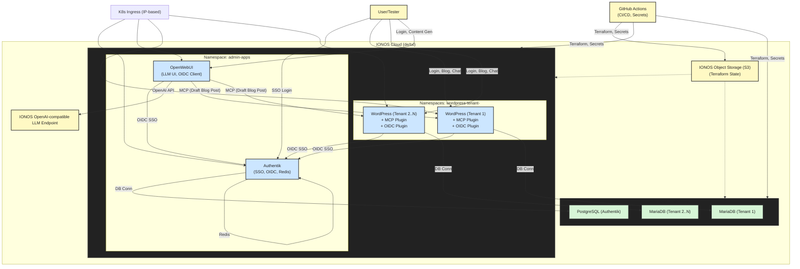

# IONOS MKS PoC: Architecture Overview

## High-Level Architecture

This document describes the architecture for the IONOS MKS Proof of Concept (PoC), which demonstrates multi-tenant WordPress, OpenWebUI, and Authentik SSO integration, all provisioned and managed via Terraform and deployed on IONOS Cloud.

### Key Components

- **IONOS Managed Kubernetes (MKS):** Hosts all application workloads.
- **IONOS Managed Databases:**
  - **MariaDB:** One per WordPress tenant.
  - **PostgreSQL:** For Authentik.
- **IONOS Object Storage (S3):** Stores Terraform state.
- **IONOS OpenAI-compatible LLM Endpoint:** Used by OpenWebUI.
- **GitHub Actions:** CI/CD, secrets management, and automation.
- **Kubernetes Namespaces:**
  - `admin-apps`: Authentik, OpenWebUI
  - `tenant-<name>`: One per WordPress tenant
- **Ingress:** IP-based access to all UIs (no custom domains/TLS).
- **Secrets:** Managed via GitHub Actions and Kubernetes Secrets.

### Application Integrations

- **Authentik:** SSO provider (OIDC) for both OpenWebUI and all WordPress tenants. Uses PostgreSQL and Redis.
- **OpenWebUI:** LLM UI, OIDC client to Authentik, connects to LLM endpoint, and communicates with WordPress tenants via MCP.
- **WordPress (per tenant):** OIDC client to Authentik, includes MCP and custom integration plugins, connects to its own MariaDB.

---

## Architecture Diagram

---

## Summary

- **Multi-tenancy:** Each WordPress tenant is isolated (namespace, DB, plugins), but shares Authentik and OpenWebUI.
- **SSO:** Authentik provides OIDC SSO for all apps.
- **Content Generation:** OpenWebUI uses the IONOS LLM and can send drafts to any tenant's WordPress via MCP.
- **Automation:** All infra and secrets are managed via Terraform and GitHub Actions.
- **Ingress:** All UIs are accessible via IP-based ingress (no custom domains/TLS for PoC).
