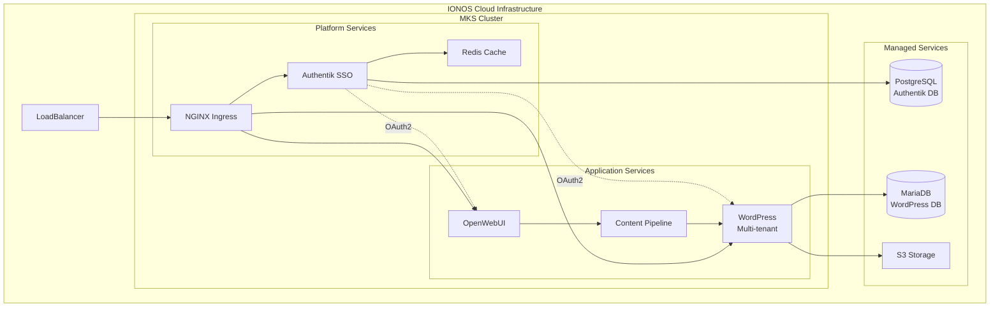

# System Architecture

> **Architecture Version**: 2.0
> **Last Updated**: 2025-07-10

## Architecture Overview



## Layer Architecture

### Infrastructure Layer
- **Provider**: IONOS Cloud
- **Region**: DE-TXL (Berlin)
- **Components**:
  - Managed Kubernetes Service (MKS)
  - PostgreSQL Managed Database
  - MariaDB Managed Database
  - S3-compatible Object Storage
  - External LoadBalancer

### Platform Layer
- **Authentication**: Authentik SSO with Redis session store
- **Ingress**: NGINX Ingress Controller
- **Secrets**: Kubernetes native secrets management
- **Networking**: Calico CNI with network policies
- **Storage**: Dynamic PVC provisioning

### Application Layer
- **WordPress**: Multi-tenant CMS with MCP plugin
- **OpenWebUI**: AI chat interface with IONOS AI
- **Content Pipeline**: OAuth2-secured content automation
- **Integration**: REST APIs and webhooks

## Service Architecture

### Authentik SSO Architecture
```
Authentik SSO
├── Server (Django application)
│   ├── OAuth2 Provider
│   ├── OIDC Provider
│   └── User Management
├── Worker (Background tasks)
│   ├── Email notifications
│   └── Token cleanup
├── PostgreSQL Backend
└── Redis Session Store
```

### WordPress Architecture
```
WordPress Multi-tenant
├── Core WordPress
├── MCP Plugin
│   ├── Content API
│   ├── OAuth2 Client
│   └── Webhook handlers
├── MariaDB Database
└── S3 Media Storage
```

### OpenWebUI Architecture
```
OpenWebUI Platform
├── Frontend (React)
├── Backend API
├── IONOS AI Integration
├── OAuth2 Client
└── Pipeline Service
    ├── Content Processor
    ├── WordPress Client
    └── Workflow Engine
```

## Data Flow Architecture

### Authentication Flow
1. User accesses service
2. Redirect to Authentik SSO
3. OAuth2 authorization
4. Token validation
5. Service access granted

### Content Publishing Flow
1. User creates content in OpenWebUI
2. Pipeline service processes content
3. OAuth2 authentication to WordPress
4. Content published via REST API
5. Webhook confirms publication

## Network Architecture

### External Access
- **LoadBalancer IP**: <loadbalancer-ip>
- **DNS Mapping** (via Host headers):
  - `wordpress-tenant1.local`
  - `openwebui.local`
  - `authentik.local`

### Internal Communication
- **Service Discovery**: Kubernetes DNS
- **Network Policies**: Enforced isolation
- **TLS**: Terminated at LoadBalancer
- **Internal TLS**: Planned for service mesh

## Security Architecture

### Authentication & Authorization
- **SSO Provider**: Authentik
- **Protocol**: OAuth2/OIDC
- **Token Storage**: Redis (short-lived)
- **Session Management**: Secure cookies

### Network Security
- **Ingress**: Rate limiting enabled
- **Firewall**: IONOS Cloud firewall rules
- **Network Policies**: Pod-to-pod restrictions
- **TLS**: v1.2+ enforced

### Data Security
- **Secrets**: Kubernetes encrypted secrets
- **Database**: TLS connections
- **Storage**: Encrypted at rest
- **Backups**: Encrypted snapshots

## Scalability Architecture

### Horizontal Scaling
- **WordPress**: StatefulSet ready
- **OpenWebUI**: Deployment scalable
- **Authentik**: Multi-replica capable
- **Databases**: Managed HA clusters

### Vertical Scaling
- **Node Pools**: Auto-scaling ready
- **Resources**: Defined limits/requests
- **Storage**: Dynamic expansion

## Monitoring Architecture

### Metrics Collection
- **Prometheus**: Metrics aggregation
- **Node Exporter**: System metrics
- **Service Metrics**: Application endpoints

### Visualization
- **Grafana**: Dashboards
- **Alerts**: Prometheus AlertManager
- **Logs**: ELK stack

## Deployment Architecture

### GitOps Flow
```
GitHub Repository
├── terraform/
│   ├── infrastructure/
│   └── platform/
├── charts/
│   └── Custom Helm charts
├── manifests/
│   └── Kubernetes YAMLs
└── .github/workflows/
    └── CI/CD pipelines
```

### Deployment Strategy
- **Infrastructure**: Terraform managed
- **Platform**: Helm charts
- **Applications**: Kubernetes manifests
- **Secrets**: External secrets operator

## Multi-Tenant Architecture

### Tenant Isolation
- **Namespaces**: Per-tenant isolation
- **Databases**: Separate schemas
- **Storage**: Isolated S3 prefixes
- **Networks**: Policy-based isolation

### Tenant Provisioning
1. Create namespace
2. Deploy WordPress instance
3. Configure database
4. Set up OAuth2 client
5. Configure storage
6. Apply network policies

## Disaster Recovery Architecture

### Backup Strategy
- **Databases**: Daily automated backups
- **Persistent Volumes**: Snapshot schedule
- **Configuration**: Git repository
- **Secrets**: Encrypted backup vault

### Recovery Procedures
- **RTO**: 4 hours
- **RPO**: 24 hours
- **Failover**: Manual
- **Testing**: Quarterly DR drills

## Future Architecture Enhancements

### Short Term (Q3 2025)
- Service mesh implementation
- Automated certificate management
- Centralized logging
- Advanced monitoring

### Long Term (Q4 2025)
- Multi-region deployment
- Edge caching with CDN
- Advanced analytics platform
- AI/ML pipeline integration